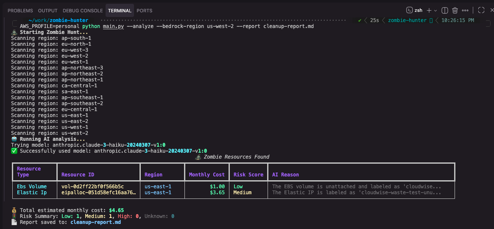

# 🧟 Zombie Hunter
**The AI-Powered Cloud Waste Analyst**

[](https://opensource.org/licenses/MIT)
[](https://www.python.org/downloads/)
[](https://aws.amazon.com/bedrock/)

**Zombie Hunter** is a CLI tool that hunts down "zombie" AWS resources—unattached EBS volumes and idle Elastic IPs—that are silently draining your budget. 

Unlike standard cleanup scripts, Zombie Hunter uses **Generative AI (Amazon Bedrock)** to analyze resource metadata (tags, names, age) and generate a **Deletion Risk Score**. It tells you *why* a resource was likely abandoned and whether it's safe to delete, giving you the confidence to clean up your cloud.



---

## 🚀 Features

*   **🔍 Deep Scanning:** Instantly finds unattached EBS volumes and unassociated Elastic IPs across all (or specific) regions.
*   **🤖 AI Risk Analysis:** Uses Claude 3 (via Amazon Bedrock) to evaluate "Deletion Risk" (Low/Medium/High) based on resource context.
*   **💰 Cost Estimation:** Calculates potential monthly savings for every identified resource.
*   **✨ Rich UI:** Beautiful, color-coded terminal output using the `rich` library.
*   **📄 Report Generation:** Exports detailed findings to a Markdown report for team review.

---

## 🛠️ Installation

1.  **Clone the repository:**
    ```bash
    git clone https://github.com/yourusername/zombie-hunter.git
    cd zombie-hunter
    ```

2.  **Install dependencies:**
    ```bash
    pip install -r requirements.txt
    ```

3.  **Configure AWS Credentials:**
    Ensure you have your AWS credentials set up:
    ```bash
    aws configure
    ```
    *Note: To use the AI features, your AWS account must have access to Amazon Bedrock (Claude 3 Haiku or Sonnet).*

---

## 🎮 Usage

### Basic Scan (Find Zombies)
```bash
python main.py
```

### AI Analysis Mode (Recommended)
Scans resources and uses Bedrock to generate risk scores and reasoning.
```bash
python main.py --analyze
```

### Generate a Report
Save the findings to a Markdown file for your team or clients.
```bash
python main.py --analyze --report cleanup_report.md
```

### Scan Specific Regions
```bash
python main.py --regions us-east-1 --regions us-west-2
```

---

## 🧠 How It Works

1.  **Discovery:** Uses `boto3` to query AWS APIs for resources in "available" (EBS) or "unassociated" (EIP) states.
2.  **Context Gathering:** Collects metadata: tags, creation dates, volume types, and naming patterns.
3.  **AI Inference:** Sends an anonymized summary of the metadata to Amazon Bedrock. The LLM acts as a "Cloud Ops Analyst" to determine if the resource looks like a leftover test artifact or a critical backup.
4.  **Presentation:** Displays a sorted, prioritized list of actions.

---

## 🔮 About CloudWise

**Zombie Hunter** is a lightweight, open-source tool for quick tactical cleanups. 

For comprehensive, strategic cloud cost intelligence, check out **[CloudWise](https://cloudwise.example.com)**. CloudWise provides:
*   Multi-account cost anomaly detection.
*   Deep architectural insights.
*   Automated consultant-grade reporting.

*Built with ❤️ by the CloudWise Team.*
